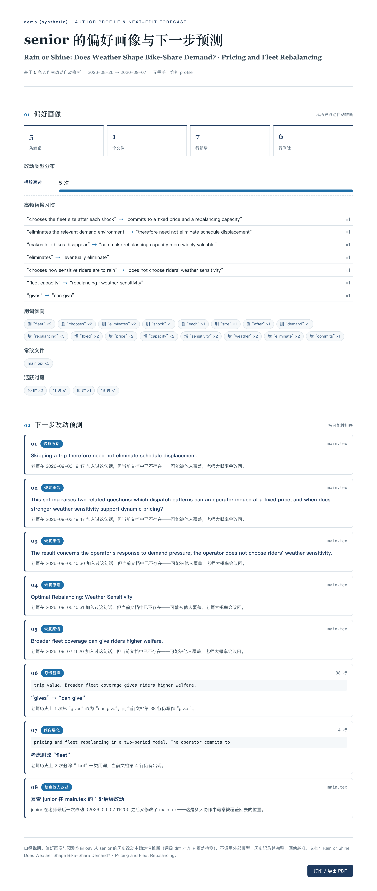

# Overleaf Author View (oav)

从 **Overleaf 多人协作历史**中，按作者提取改动，生成「某位老师偏好」的**一页 HTML**。

多人同时在 Overleaf 上改一篇稿子（例如 junior 与 senior 两位老师），相互覆盖、当前文件只剩最后一位写者。`oav` 让你**选定某一位老师（如 senior）**，从他的改动出发，自动产出三类一页 HTML：

- **report** — 这位老师改了什么：时间线 + 逐文件增删 diff（适合对齐、复盘、审阅）。
- **onepager** — 以这位老师的原话与偏好口径为骨架的一页概览（适合给老师看、或作为汇报单页）。
- **next** — 从这位老师的历史改动**自动推断偏好画像**，并**预测他下一步最可能改什么**（适合在发给老师前自查）。

核心为零依赖 Python 标准库，一行命令即可运行。

```
Overleaf 历史 (git clone / JSONL 导出)
        │
        ▼
  oav 归一化 → 按作者过滤（--author senior）
        │
        ├──► report   ：改动记录一页 HTML（确定性，无需联网）
        ├──► onepager ：老师偏好一页 HTML（启发式；可选 LLM 叙事）
        └──► next     ：偏好画像 + 下一步改动预测（确定性，无需联网）
```

## Sample

`next` 命令的输出长这样（合成 bike-share 数据，与任何真实稿件无关）：



图中可以看到：senior 被 junior 覆盖的 5 句原话全部被识别为「恢复原话」候选，「gives → can give」的习惯替换被定位到当前文档正文行。

## 安装

需要 Python 3.9+，无第三方依赖。

```bash
git clone https://github.com/<your-name>/overleaf-author-view.git
cd overleaf-author-view
python3 oav.py --help
```

## 用法

### 输入：两种来源，二选一

1. **Overleaf git 桥克隆**（推荐，含完整提交历史与作者名）
   ```bash
   git clone https://git.overleaf.com/<project-id> /tmp/proj
   python3 oav.py report --input /tmp/proj --author senior --output report-senior.html
   ```
2. **Overleaf 历史导出 JSONL**（每行一条编辑记录）
   ```bash
   python3 oav.py report --input history.jsonl --author senior --output report-senior.html
   ```
   JSONL 字段：
   ```json
   {"author":"senior","time":"2026-09-03T19:47:00+08:00","file":"main.tex","msg":"rewrite intro","added":["..."],"removed":["..."]}
   ```

### 生成老师偏好一页（onepager）

```bash
python3 oav.py onepager \
  --doc main.tex \                  # 当前主文档（LaTeX/纯文本）
  --changes history.jsonl \         # 历史记录（或 git 目录）
  --author senior \
  --profile profile.senior.json \   # 该老师的偏好画像（可选）
  --output onepager-senior.html
```

- **启发式模式（默认）**：标题/摘要/章节来自文档本身，`蓝字块` 即该老师历史改动中的原话，偏好来自 profile（口径 chips、framing）。
- **LLM 叙事模式（可选）**：接入任意 OpenAI 兼容接口，让模型按该老师的口径撰写段落；失败自动回退启发式。
  ```bash
  export OAV_LLM_KEY=sk-...
  python3 oav.py onepager --doc main.tex --changes history.jsonl \
    --author senior --profile profile.senior.json --llm \
    --llm-endpoint https://api.deepseek.com/v1 --llm-model deepseek-chat
  ```

### 推断老师下一步改动（next）

```bash
python3 oav.py next \
  --doc main.tex \                # 当前主文档
  --changes history.jsonl \       # 历史记录（或 git 目录）
  --author senior \
  --output next-senior.html
```

输出一页 HTML，含两部分：

- **偏好画像（自动推断，无需手工维护 profile）**：改动类型分布（措辞/公式/引用/结构）、高频替换习惯（`X → Y`）、用词倾向（倾向删除/加入的词）、常改文件、活跃时段。
- **下一步改动预测**（按可能性排序），四类确定性信号：
  1. **恢复原话** — 老师加过、但当前文档已不存在的句子（被他人覆盖 → 大概率改回）；
  2. **习惯替换** — 老师历史上反复 `X → Y`，而当前文档仍写作 `X`（带行号定位）；
  3. **倾向弱化** — 老师高频删除的用词仍出现在文档中；
  4. **复查他人改动** — 老师最后一次改动之后，junior 又动过的文件（最容易被覆盖回去的位置）。

### 演示

```bash
python3 oav.py report   --input examples/history.sample.jsonl --author senior --output /tmp/report-senior.html
python3 oav.py onepager --doc examples/main.sample.tex --changes examples/history.sample.jsonl \
  --author senior --profile examples/profile.senior.json --output /tmp/onepager-senior.html
python3 oav.py next     --doc examples/main.sample.tex --changes examples/history.sample.jsonl \
  --author senior --output /tmp/next-senior.html
```

### Sample 输出

见上文 [Sample](#sample) 的截图（[`assets/sample.png`](assets/sample.png)）。重新生成：

```bash
python3 oav.py next --doc examples/main.sample.tex --changes examples/history.sample.jsonl \
  --author senior --project "demo (synthetic)" --output /tmp/sample.html
# 可选：用 headless Chrome 截成 PNG
"/Applications/Google Chrome.app/Contents/MacOS/Google Chrome" \
  --headless=new --hide-scrollbars --force-device-scale-factor=2 \
  --window-size=1100,2600 --screenshot=assets/sample.png file:///tmp/sample.html
```

## 老师偏好从哪来

1. **原话优先**：该老师历史改动中被加入的句子，以「蓝字块」呈现——这是其偏好的最直接证据。
2. **自动画像（next）**：词级 diff 对齐挖出替换习惯，覆盖检测找出被他人抹掉的原话——全部从历史推断，零配置。
3. **画像 profile.json**（onepager 可选）：`framing`（表述口径）、`chips`（关键词标签）、`title_hint`（标题倾向），由使用者维护，随项目演进。
4. **风格模板**：内置学术简洁风（可打印/导出 PDF）；`--style` 预留扩展。

## 目录

```
oav.py                        # 单文件 CLI（零依赖）
assets/
  sample.png                  # README 里的 sample 截图（合成数据）
examples/
  main.sample.tex             # 合成示例文档（bike-share 题材，与真实稿件无关）
  history.sample.jsonl        # 合成示例历史（senior/junior 双作者）
  profile.senior.json         # 示例老师画像
LICENSE                       # MIT
```

## Roadmap

- [x] 老师偏好自动画像 + 下一步改动预测（`next` 命令，确定性启发式）
- [ ] Overleaf API 直接拉取项目历史（免 git 桥）
- [ ] 多老师对比视图（junior vs senior 改动同页对照）
- [ ] 下一步预测接入 LLM 排序/解释（当前为纯启发式）
- [ ] Web UI（拖拽上传历史 → 在线生成）

## 注意

示例数据为**合成**数据，仅演示流程，不包含任何真实稿件内容。真实使用请用你自己的 Overleaf 导出。

## License

MIT
